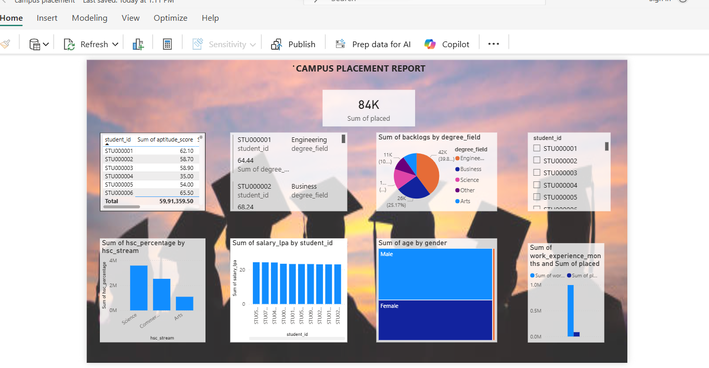

# Campus-Placement-Analysis
Campus Placement Analysis Dashboard
Project Overview:
This project analyzes campus placement data to identify the key factors influencing student placements. The objective is to understand placement trends, salary distribution, and how academic performance and skills impact job offers.
Objectives:
Analyze overall placement percentage
Identify impact of CGPA on placements
Study salary package distribution
Understand the role of internships and communication skills
Provide insights to improve student employability
Tools & Technologies Used:
Microsoft Excel (Data Cleaning & Preparation)
Power BI (Data Visualization & Dashboard Creation)
Dataset Description:
The dataset includes:
Academic performance (CGPA, 10th & 12th marks)
Specialization
Internship experience
Communication skills
Placement status
Salary package expected
Key Insights:
Students with higher CGPA have better placement probability
Internship experience increases chances of placement
Strong communication skills positively impact job offers
Certain specializations show higher placement rates
📊 Dashboard Preview

